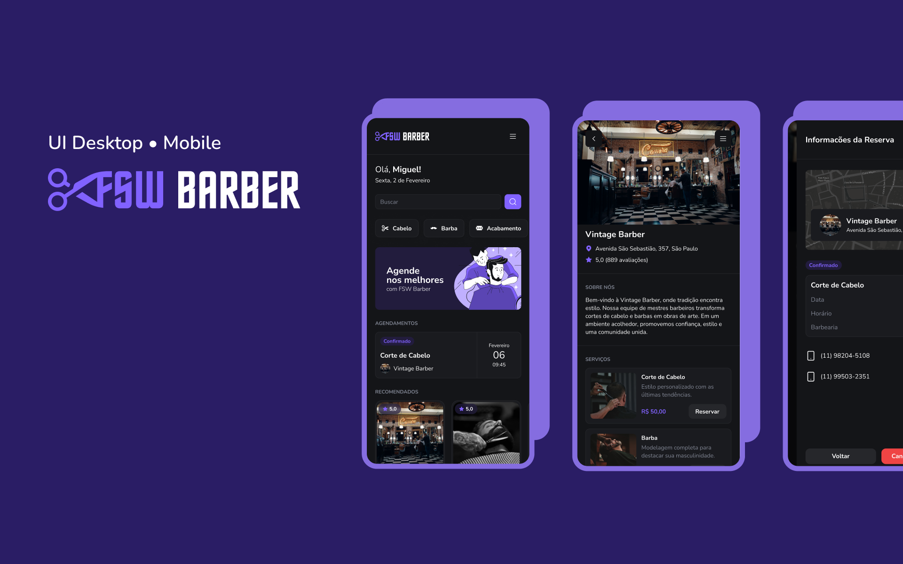

# 💈 Barber SaaS

  

Aplicação fullstack para gestão de barbearias, desenvolvida para praticar **React, Next.js, Node.js e integração com banco de dados**.  
O foco é oferecer uma interface moderna, responsiva e segura, permitindo **reservas reais de serviços** e gerenciamento de clientes.

---

## 🚀 Tecnologias

---

## ⚙️ Funcionalidades

- Login seguro com **autenticação via Google**
- Cadastro e gerenciamento de clientes
- Reservas de serviços com datas e horários reais
- Dashboard com acompanhamento de reservas
- Interface totalmente responsiva (Mobile e Desktop)

---

## 🌐 Acesse a aplicação

👉 [Barber SaaS - Deploy na Vercel](https://project-barber-he61.vercel.app)

---

## 📬 Contato

Lucas Sarasa  
  

